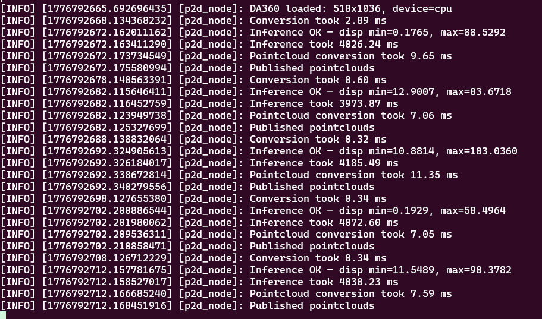
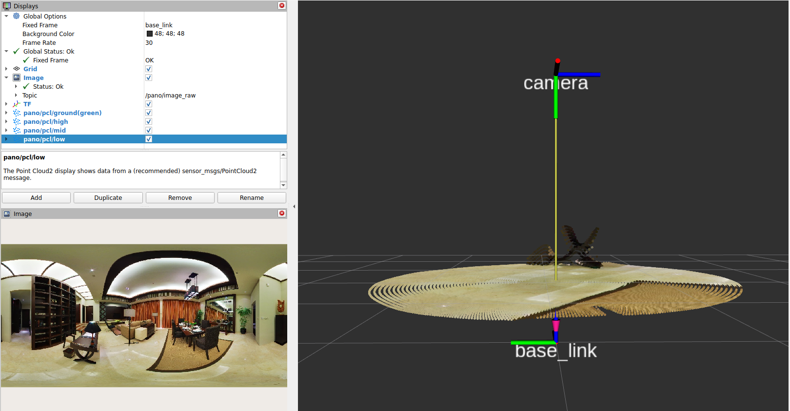
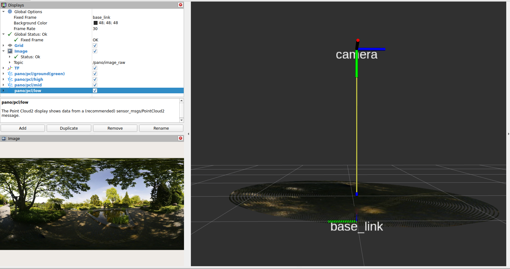
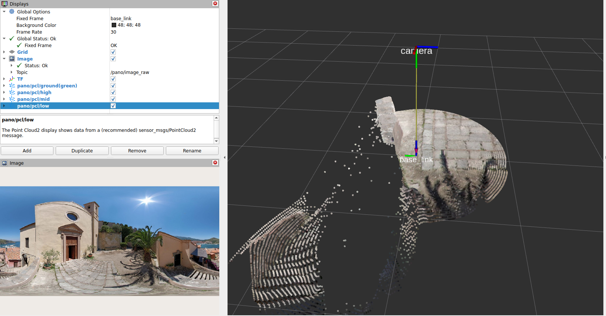
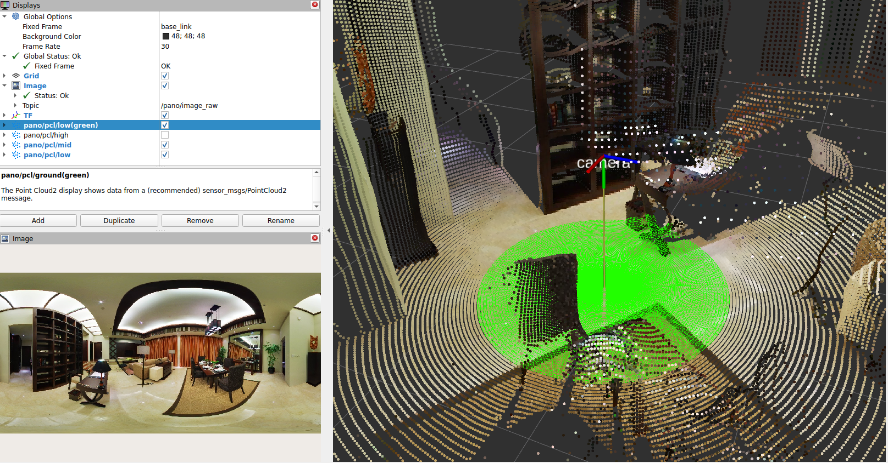

# Evaluation and Reflection

## Runtime Notes
CPU: Intel Core Ultra 9 185H

Inference was the main bottleneck. The DA360 model ran using pytorch cpu.

In the interest of time, additional configuration was not performed to use cuda.

Usually, rostopic hz would be executed to benchmark the latency. However, the panoramic images were being published at 0.1hz, and therefore performing benchmarking based off rostopic hz may not be the most accurate.

Other tools that can be used to benchmark include flamegraphs and valgrind.

## Qualitative results

Here we can see a visualisation of /pcl/low.

Note the orientation of base_link.

We can see that there is a flat plane, which is the ground.
We can also see that there are points above the flat plane. These are positive points. These positive points can be easily segmented via ransac or other traditional pcl techniques.

Lighting can affect the quality of the depth image, and therefore the projected pcl/low.

We can see that the pcl/low is slightly tilted, even though the ground is likely to be flat.

Occlusion can cause trailing points. This is also an example of negative obstacles. It may be difficult to tell which is the ground plane. More experiments are needed to determine if 
the ground plane will always be the nearest to base_link

For reference. Green points are pcl/low. The rest are pcl/mid.
PCL mid will be able to inform the robot on navigable space at a larger distance.

## Engineering reflection
1. Unit tests should be written to ensure correct logic and correct implementation of pointcloud projection is performed.
- For example, the projected pointcloud produced by DA360 test script should be saved.
- Then, the test will pass if the projected pointcloud produced by this node is roughly the same as the one produced by DA360 test script

2. Because CPU inference is performed, it is expected that the latency is high.
- If the robot has no GPU, the robot should stop moving and then perform the inference.
- This is so that the inference result for determining navigability for example, can be trusted.
- This should only be used in safety critical scenarios, or last resort scenarios, for example:
  - Negative obstacle sensors were triggered by robot. Robot cannot resolve a path to return to dock
  - In this case, the robot is stopped anyway, so we can run this pipeline

3. This pipeline, as well as the samples here are all images.
- Therefore, it is even more important that the camera has a high frame rate, to reduce blurring.
- More information is needed to determine if the behaviour is the same for video/brightness

